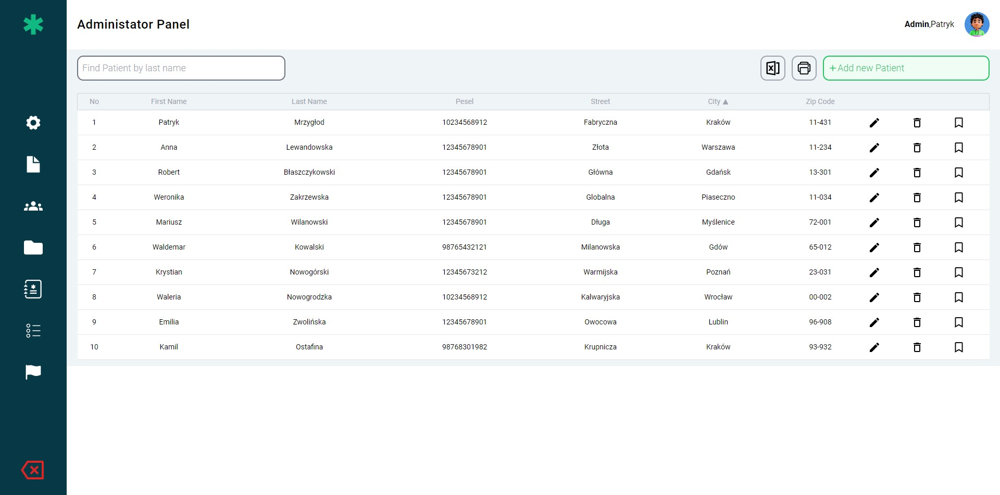

# How to run local app

## Prerequisites

- Make sure you have Node.js installed on your system (https://nodejs.org/).
- Make sure you have MySQL installed on your system (https://dev.mysql.com/downloads/mysql/).

## Installation Steps

1. Clone the app from GitHub:
   git clone https://github.com/PatrykkM/ClinicPatientDashboard.git
2. Change directory to the app's folder:
   cd ClinicPatientDashboard
3. Install npm packages:
   npm install
4. Create a MySQL database and set up the schema and seed data
   code to create database and values to database is in patients.sql file
5. Configure the database connection:

   - Navigate to the `server` folder.
   - Create a `.env` file in the `server` directory.
   - Add the following content to the `.env` file, replacing the placeholders with your actual MySQL credentials:
     ```
     DB_HOST=localhost
     DB_USER=root
     DB_PASSWORD=your_mysql_root_password
     DB_NAME=patients
     ```
   - Make sure the MySQL service is running and the credentials match the user and password of your MySQL database.

6. Start the server:
   cd server
   node index.js
7. Start the client
   npm run dev
   ## CLIENT MUST WORK ON PORT 5173
8. Enjoy the view :D
   
